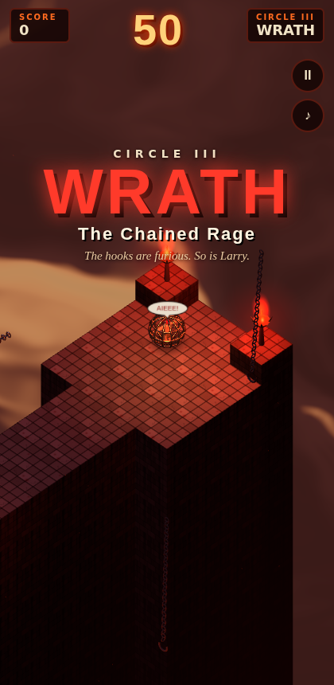
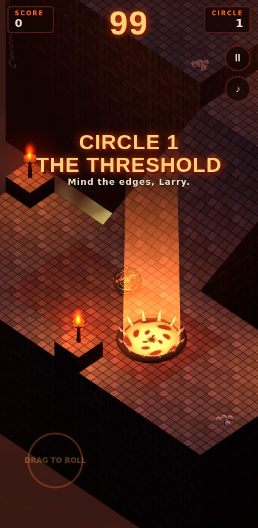
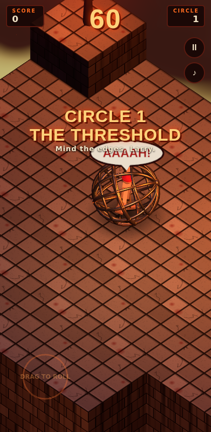
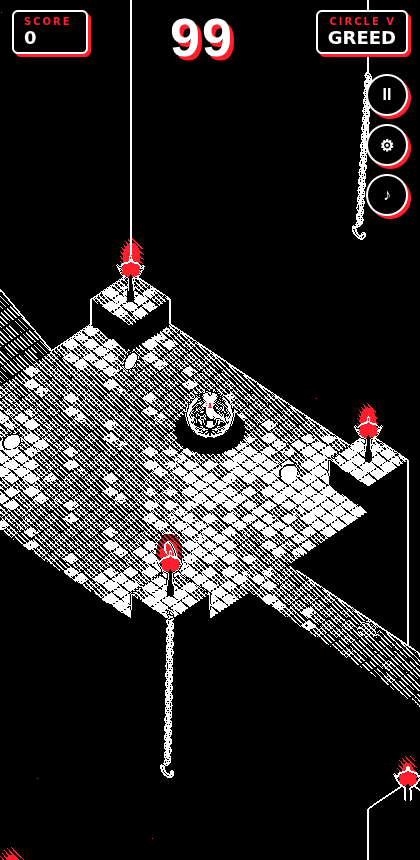
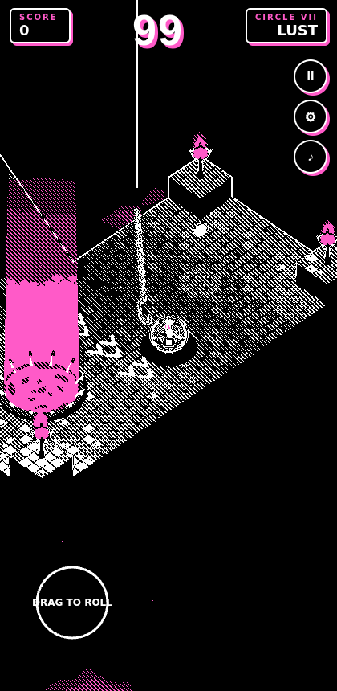
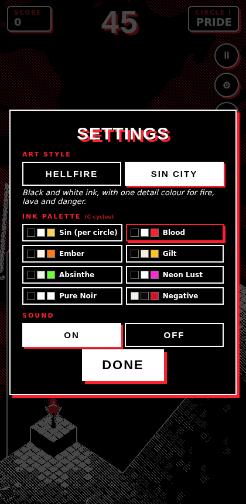

# Labyrinth Larry

A *Marble Madness*-style arcade game for phones and desktop. Larry is a damned
soul in a loincloth, strapped inside a giant iron gyro-cage, and he screams a
lot. Roll him down through seven circles, one for each deadly sin, of a Hades /
Hellraiser labyrinth: a torch-lit dungeon floating over a sea of fire. Drop him
into the hellmouth at the bottom of each circle before the sands run out. You steer with a
floating virtual thumbstick, adapted from
[gig-ambulance](https://github.com/mtd-public/gig-ambulance).

| | | |
|---|---|---|
|  |  |  |

## Play

Play online: **https://mtd-public.github.io/labyrinth-larry/** (every push to
`main` deploys via `.github/workflows/pages.yml`).

There's no build step. Serve the folder and open it on a phone, or in a
narrow desktop window:

```
python3 -m http.server 8080
# or: npx http-server -p 8080
```

Then open `http://localhost:8080`.

**Controls**
- **Touch / mouse:** press anywhere and drag toward where Larry should roll.
  Deflection is throttle. Release to coast.
- **Keyboard:** WASD or arrow keys. **P** pauses, **M** mutes, **C** cycles ink
  palettes (Sin City only).
- **⚙ Settings** (title screen, or the cog in play): art style, ink palette, sound.

## Art styles

The ⚙ settings card switches between two looks. Your choice is saved, and a
link can pick one: `?art=ink&palette=blood` or `?art=classic`.

- **Hellfire** (classic): full-colour torchlight over a sea of fire, tinted per sin.
- **Sin City** (ink): black and white only, with one detail colour. Flames have
  white-hot cores with accent flickers around them. Lava and the hellmouth
  are the accent too, and Larry's beanie is the only colour on him. Stone is
  engraved with line hatching, edges are inked in the opposite tone, and ash
  falls through the void. The palette picks the accent: each sin's own colour
  (default), Blood, Ember, Gilt, Absinthe, Neon Lust, Pure Noir, or Negative
  (inverted paper and ink).

| | | |
|---|---|---|
|  |  |  |

It's a 3D take on the two-tone style that dive-depths uses in 2D. Every
material draws a *role* (ink, paper or accent), not a colour, and a single
post pass turns those roles into the palette (`js/ink.js`):

1. **Material patch.** `inkify(scene)` appends a few lines to each built-in
   material's fragment shader. In ink mode a material writes its luminance as
   grey (`mono`), flat white (`paper`, used for Larry so he pops), or pure
   key-red at its brightness (`accent`). One shared uniform flips every
   material at once, with no recompile.
2. **Post pass.** The frame renders to a target with a depth texture. One
   full-screen shader then maps key-red to the accent colour, and grey to ink,
   three densities of diagonal hatching, or paper. Depth edges are drawn in
   the opposite tone.

Soft halos are hidden in ink mode (`inkHide`), and Larry gets a solid black
shadow pool so the white figure always reads.

**Rules**
- The course runs downhill toward the camera. Ramps speed you up.
- A fall of more than about 4.6 units (taller than a man) breaks Larry. Short
  drops just clank.
- Death costs time: you respawn at the last rune-circle checkpoint you rolled over.
- **Lament boxes** give +5 seconds. Leftover time carries into the next circle
  and pays a bonus.

## The seven circles

Each circle opens with its Sin title card. Each sin has its own colours
(torchlight, fog and the sea of fire) and its own torment:

| | Sin | Circle | Torment |
|---|---|---|---|
| I | **Pride** | The Vaunted Spire | Ramps, safe drops and the edges |
| II | **Envy** | The Green-Eyed Fields | Soul orbs chase you; bone bridges crumble |
| III | **Wrath** | The Chained Rage | Hellraiser hooks swing across walkways; spikes and flame vents |
| IV | **Sloth** | The Tar Pits of Acedia | Tar drags you to a crawl, so carry momentum in |
| V | **Greed** | The Gilded Ledges | Coins (+100) sit on spurs off narrow ledges |
| VI | **Gluttony** | The River of Grease | Grease makes you slide; lava and flame vents |
| VII | **Lust** | The Tempest Labyrinth | Wind tiles shove you through two walled mazes |

## Code map

All assets are simple procedural 3D (three.js primitives and canvas
textures). There are no image or audio files.

| File | What it does |
|---|---|
| `js/levels.js` | Level builder: ASCII `map` patches (legend at the top) joined by `ramp`s |
| `js/sins.js` | The seven sins: names, title cards and each circle's palette |
| `js/ink.js` | Sin City art style: ink palettes, material role patch, hatching/edge post pass |
| `js/settings.js` | Saved settings (art style, palette, sound) with URL overrides |
| `js/world.js` | Height grid (every cell is a plane), merged tile/wall meshes, lava shader |
| `js/physics.js` | Rolling ball on the grid: slopes, walls, falls, ball-to-ball bounces |
| `js/larry.js` | The cage, Larry, his loincloth, run cycle and scream bubble |
| `js/props.js` | Torches, hellmouth, hooks, traps, orbs, Lament boxes, bone slabs, decor |
| `js/input.js` | Floating thumbstick and keyboard (from gig-ambulance) |
| `js/audio.js` | WebAudio synth: cage rumble, drone, formant-synthesised screams, effects |
| `js/main.js` | Game states, rules, camera, torch-light pool, HUD |

## Checking the levels

`tools/autopilot.js` finds a safe cell path from start to hellmouth in every
level. It then rolls Larry along that path with the real physics, ignoring
hazards, to prove each course can be finished. Serve the folder and run this
in the browser console on `http://localhost:8080/tools/blank.html`:

```js
const m = await import('/tools/autopilot.js');
[0, 1, 2, 3, 4, 5, 6].map(m.autopilot);
```

three.js r160 is vendored in `js/vendor` (MIT, see `THREE_LICENSE`).
